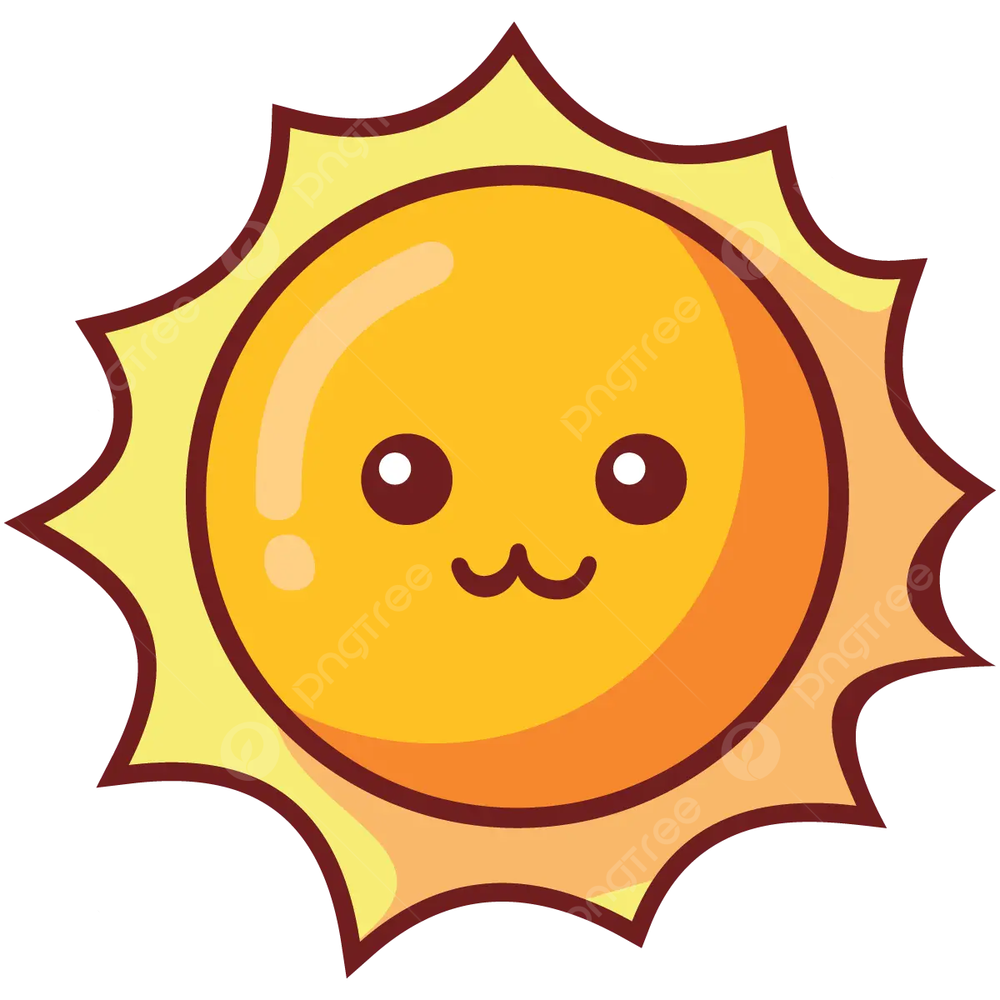

<a name="readme-top">

 

 

  
  <h3 align="center">S2-MACHINE PROBLEM</h3>

  This GitHub repository contains my output for the subject Advanced Web Design, featuring a web page with seven buttons representing each day of the week (Monday to Sunday).

 